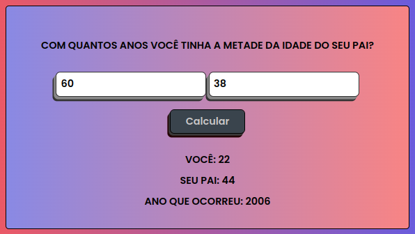

<h1 align="center"> Desafio Idade Pai - Filho </h1>

<h3 align="center">
  <a href="https://desafio-nome-pai-filho.vercel.app">Acesse Meu App</a>
</h3>

  

## 🚀 Tecnologias

Esse projeto foi desenvolvido com as seguintes tecnologias:

- HTML e CSS
- JavaScript
- Git e GitHub

## 💻 Projeto

Criar um programa que calcula com quantos anos você terá exatamente a metade da idade do seu pai.
